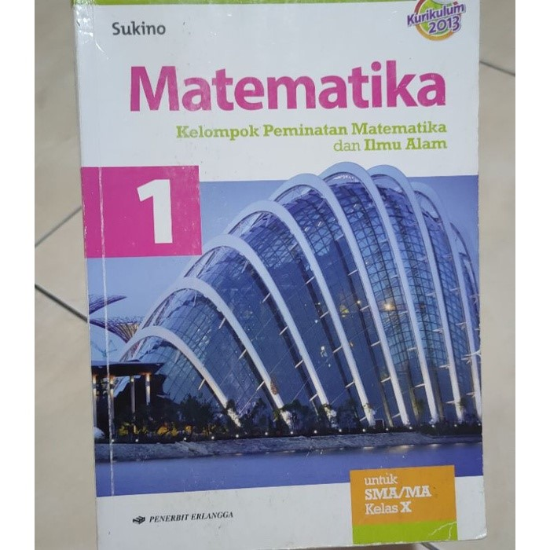

# Laporan Praktikum Pertemuan 1

## Pertanyaan
1.	Jelaskan perbedaan antara objek dengan class!
Jawab:
-	 Objek: Suatu rangkaian dalam program yang terdiri dari state dan behaviour. Objek
pada software dimodelkan sedemikian rupa sehingga mirip dengan objek yang ada
di dunia nyata.
-	Class: Blueprint atau prototype dari objek. Hasil instansiasi dari class disebut
dengan objek.
2.	Jelaskan alasan warna dan tipe mesin dapat menjadi atribut dari objek mobil!
Jawab:
Karena atribut merupakan ciri-ciri dari objek. Warna dan tipe mesin termasuk ke dalam ciri-ciri yang dimiliki mobil. Karena mereka tidak bisa melakukan semacam method atau behavior.
3.	Sebutkan salah satu kelebihan utama dari pemrograman berorientasi objek
dibandingkan dengan pemrograman struktural!
Jawab:
Kelebihan PBO adalah program dapat lebih fleksibel dan modular, jika ada perubahan fitur, maka dapat dipastikan keseluruhan program tidak akan terganggu. Berbeda dengan struktural, perubahan sedikit fitur saja kemungkinan dapat mengganggu keseluruhan program.
4.	Apakah diperbolehkan melakukan pendefinisian dua buah atribut dalam satu baris kode seperti “public String nama,alamat;”?
Jawab:
Menurut saya boleh, asalkan variable tersebut memiliki tipe data yang sama. Hal itu dikarenakan agar tidak terjadi error dan program dapat berjalan.
5.	Pada class SepedaGunung, jelaskan alasan atribut merk, kecepatan, dan gear tidak lagi ditulis di dalam class tersebut!
Jawab:
Karena pada class SepedaGunung telah menggunakan keyword “extends” class Sepeda.Keyword tersebut berfungsi untuk memperluas jangkauan class Sepeda. Sehingga pada class SepedaGunung yang merupakan pewarisan dari class Sepeda bisa mengakses atribut dan behavior yang dimiliki oleh class Sepeda.

## Tugas Praktikum

Buku

BukuKamus

BukuSekolah

Laptop

